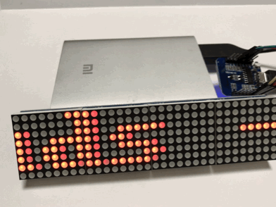
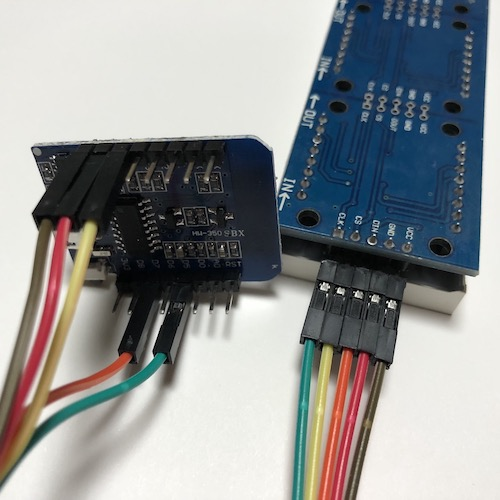
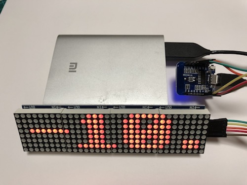
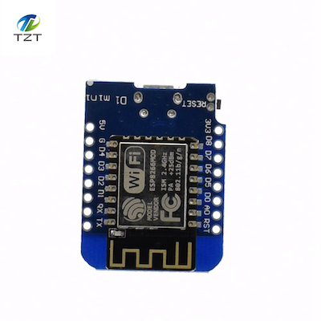
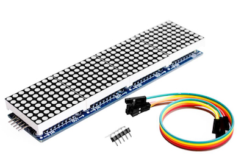

# Weather Station


## Wemos D1 mini

### Setup Arduino IDE
* 파일 > 설정 > 추가 보드 매니저 URL 
	* http://arduino.esp8266.com/stable/package_esp8266com_index.json 추가
* 도구 > 보드매니저
	* "esp8266 by ESP8266 Community" 설치
* 도구
	* 보드 > Wemos D1 R2 & mini
	* Flash Size > 4M (3M SPIFFS) 
	* Upload Speed > 115200

## Connecting WiFi
```c
#include <ESP8266WiFi.h>

WiFi.begin(WIFI_SSID,WIFI_PASS);
while (WiFi.status() != WL_CONNECTED) {
delay(500);
}
```

## Getting Weather Data
### API
* [opnweathermap.org](https://openweathermap.org/forecast5)
* http://api.openweathermap.org/data/2.5/forecast?id=1838716&units=metric&cnt=5&APPID=APIKEY
	* id = city id
	* units = temperature in Celsius
	* cnt = number of lines
```c
if (client.connect(servername, 80)) {
	String cnt = "5";
	client.println("GET /data/2.5/forecast?id="+CityID+"&units=metric&cnt="+cnt+"&APPID="+APIKEY);
	client.println("Host: api.openweathermap.org");
	client.println("User-Agent: ArduinoWiFi/1.1");
	client.println("Connection: close");
	client.println();
}

while (client.connected() || client.available()) {
	char c = client.read();
	result = result+c;
}
```

### Parsing Json
* [arduinojson library](https://arduinojson.org/)
* cnt를 2 이상으로 하면 파싱 에러 발생. *wemos d1 mini의 메모리가 작아서 그런 듯*
* **그래서 문자열을 잘라서 파싱**
```c
#include <ArduinoJson.h>

DynamicJsonBuffer json_buf;
JsonObject &root = json_buf.parseObject(jsonArray);
```

## Displaying Weather
### MAX7219 Dot Matrix Module
```c
#include <SPI.h>
#include <MAX7219_Dot_Matrix.h>

const byte chips = 4;
MAX7219_Dot_Matrix display (chips, 2);

display.sendSmooth (message, messageOffset);
```

## Assembly
* Wiring



* Finished Assembly



## Parts

* Wemos D1 mini
	* https://www.aliexpress.com/item/D1-mini-V2-Mini-NodeMcu-4M-bytes-Lua-WIFI-Internet-of-Things-development-board-based-ESP8266/32681374223.html?spm=a2g0s.9042311.0.0.XmL9Qx

* MAX7219 Dot Matrix Module
	* https://www.aliexpress.com/item/MAX7219-Dot-Matrix-Module-For-Arduino-Microcontroller-4-In-One-Display-with-5P-Line/32819783619.html?spm=a2g0s.9042311.0.0.OkFYw7
